

### Checkpoint5 (Final Project)

##### Global infos:

* Additional types are defined in `src/types.h`, like bool/uchar. Just for convinience.
* Some Additional utilities (for random number/debugging) are defined in `src/utils.h`.
* Beside the global var which is only used in `testlcd.c`, all the shared global var are in the `src/static_globals.h`
* Both dino game and testlcd share same Makefile but have different target, check README or typescript for more information.
* `set_state` is for debugging, which can indicate the current running code.

#### Part1, Peripheral devices

##### Button bank

P2 is connected to the button (switch0~7).
If the value of P2 != 0xff, means we have some button pressed:

To check which btn is pressed, we just check each bit to check if it is pressed.

##### Keypad

All provided.

##### LCD

Change the `LCD_write_string` to be Macro which will be better. (passing const char array is quite tricky)

##### testlcd.c

2producer(keypad/button) + 1comsumer(lcd display) -> total 3 thread.

* Preemptive:

  * Since the loop of each thread are quite small and fast. Use roundrobin with ThreadYield.
    `ThreadYieldSimple`:

    So we will go thourgh each thread infinitely.
* Producer:

  * The workflow is: loop -> get input -> set flag if input -> loop
  * Both btn/keypad producer have exact same structure so use one of it as example:

    
* Comsumer:

  * Comsumer will try to receive `last_xxx` if rendered flag is false.
  * once received data, display it onto the LCD display.

    
* Demo:

  

#### Part2, dino game

##### Thread managements

* Threads:
  * fixed_update(thread 0):
    * This thread is for checking the game result and updating map.
    * This thread will only be enabled when timer counter have enough count(depends on difficulty)
  * ctrl_thread(thread 1):
    * This thread will read key press and check if the key press is triggering anything
  * render_thread(thread 2):
    * This thread will read game_state/dino position/map to render the whole scene.
    * Only trigger the render process when needed. (map/state/position changed)

All the thread use ThreadYield to switch between each other.
fixed_update will only be choosed if counter reach the threshold(depends on diff)

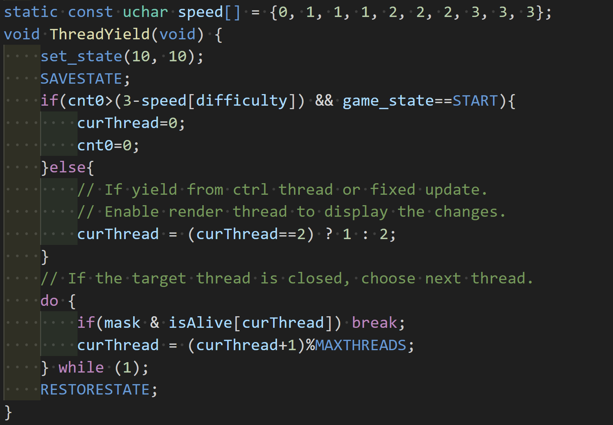

##### ctrl_thread

In this thread, we first check the key input:
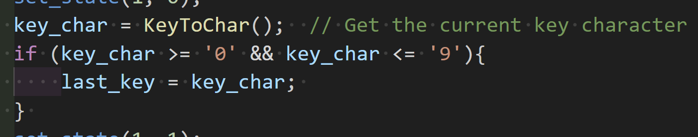

If the input is needed to be check (new input), we check the game_state to decide how to process it:

* READY: check the difficulty and # button.
  * 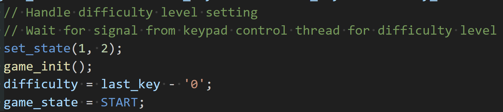
* START: Main game loop, check 2/8 for moving dino.
  * 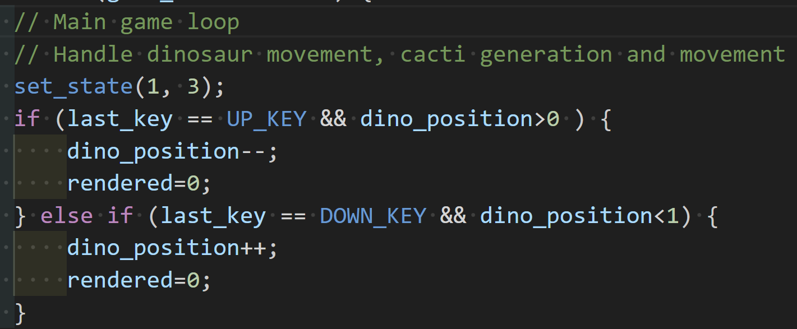
* GAMEOVER: check # button which can trigger new game. (Additional)
  * 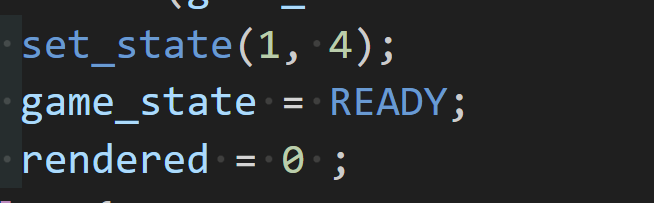

##### render_thread

This thread will utilize the LCD library (implemented in part1) to display string or map:

* READY: Print the welcome slogan.
  * 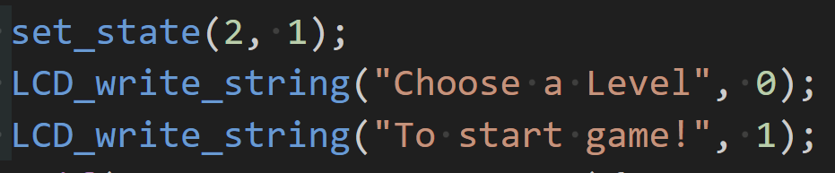
* START: Print the map
  * 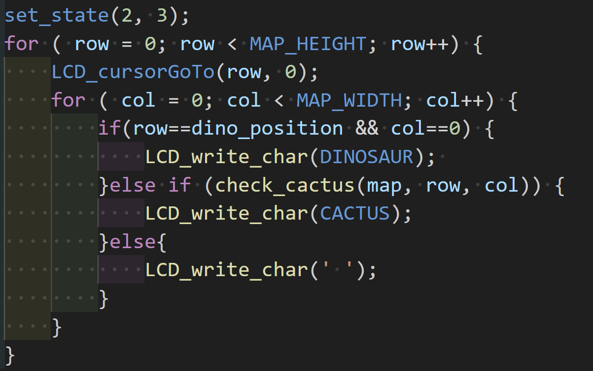
* GAMEOVER: Print the gameover slogan and score.
  * 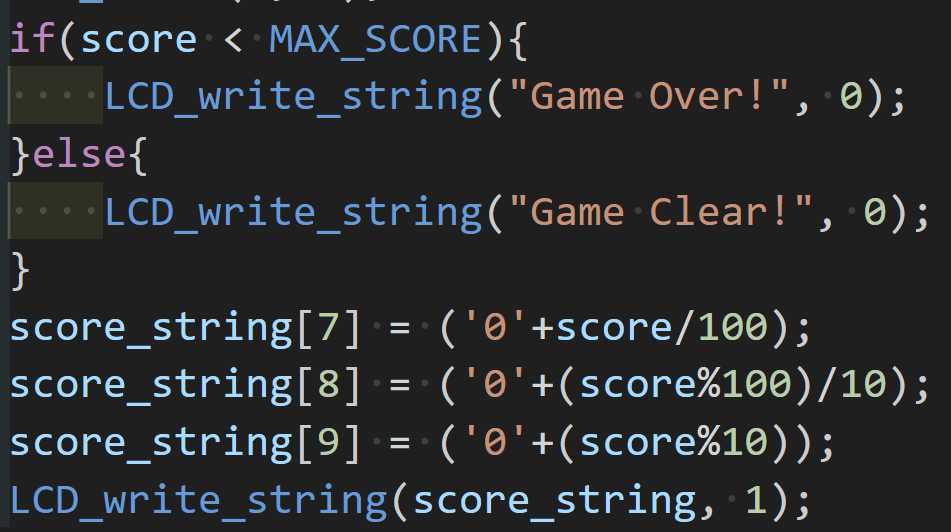

##### fixed_update

This thread will be enabled once the cnt reach target count (defined by difficulty).

In this thread, we doing map update and result check (if the dino hit the updated map).
The update strategy is random + validation. Use diffculty to determine the probability of new catus.

random update map:
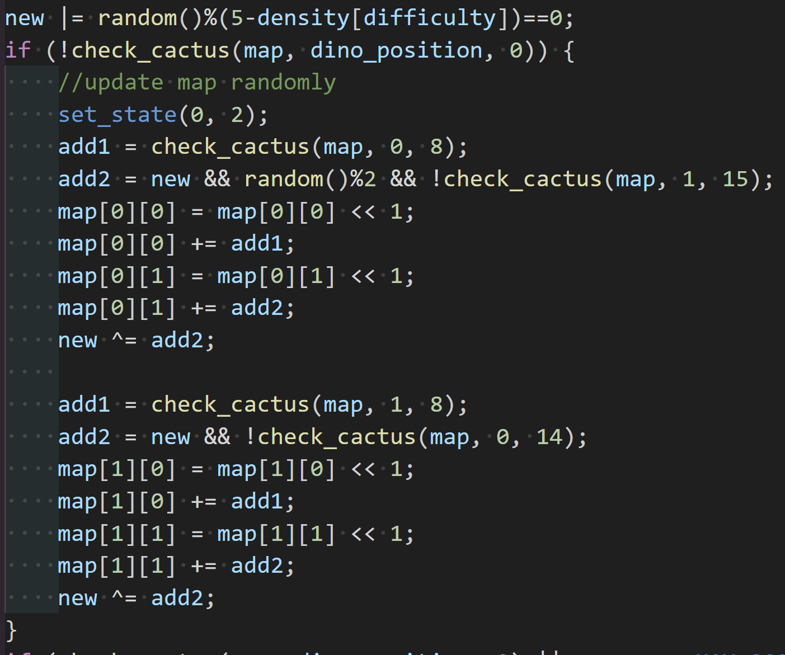

checking:
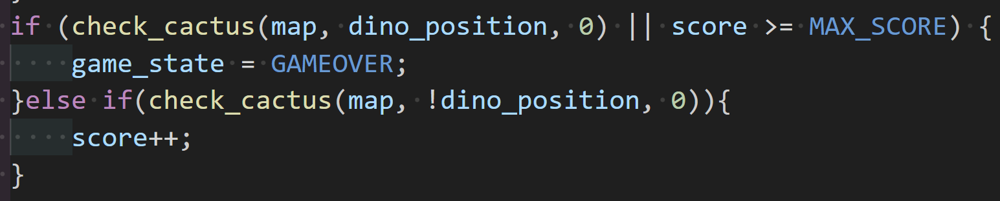

##### Demo
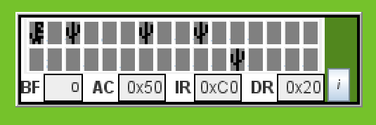
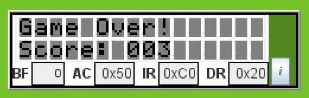