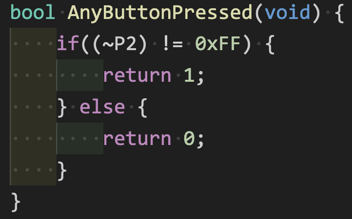
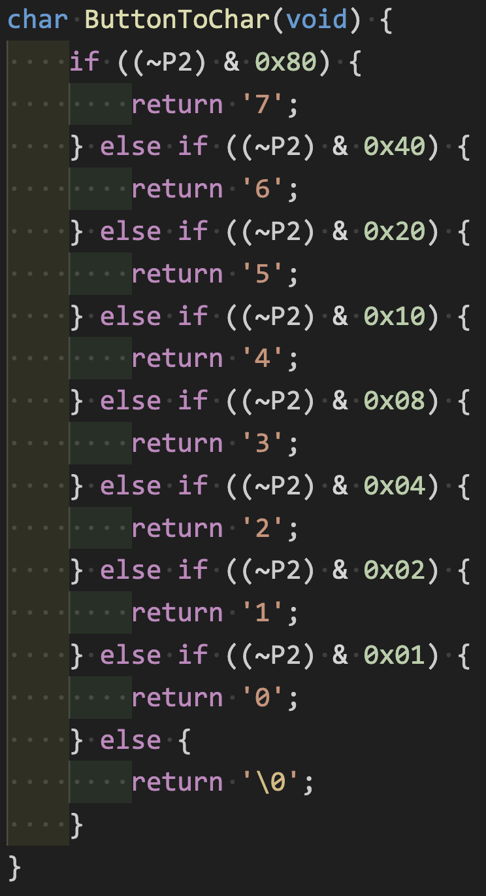
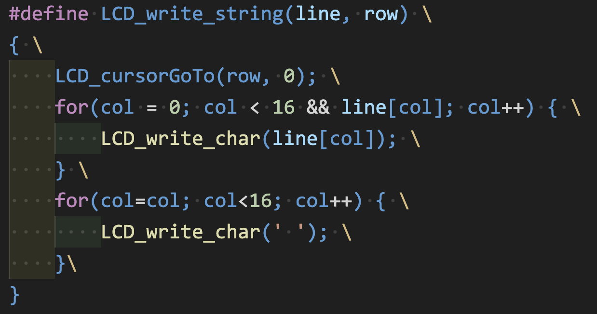
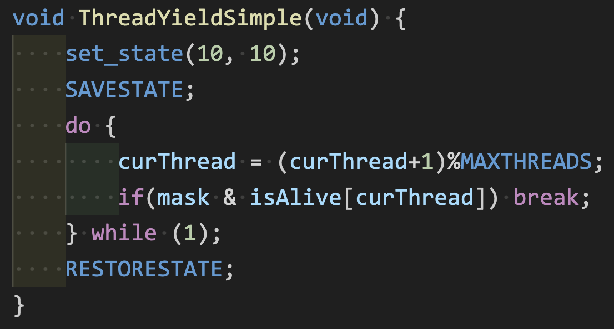
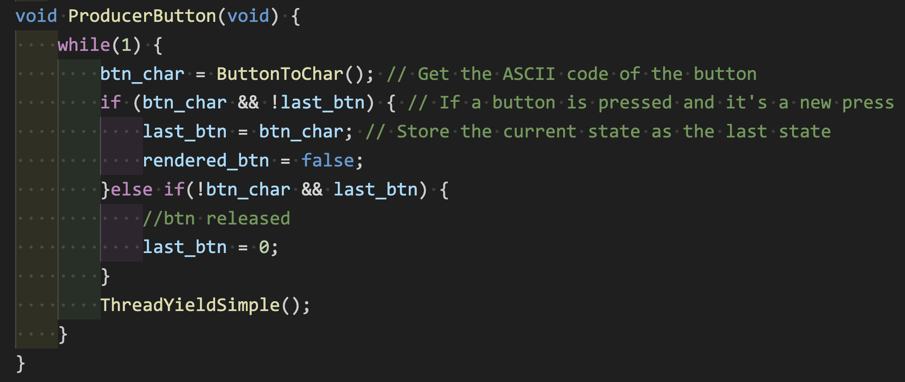
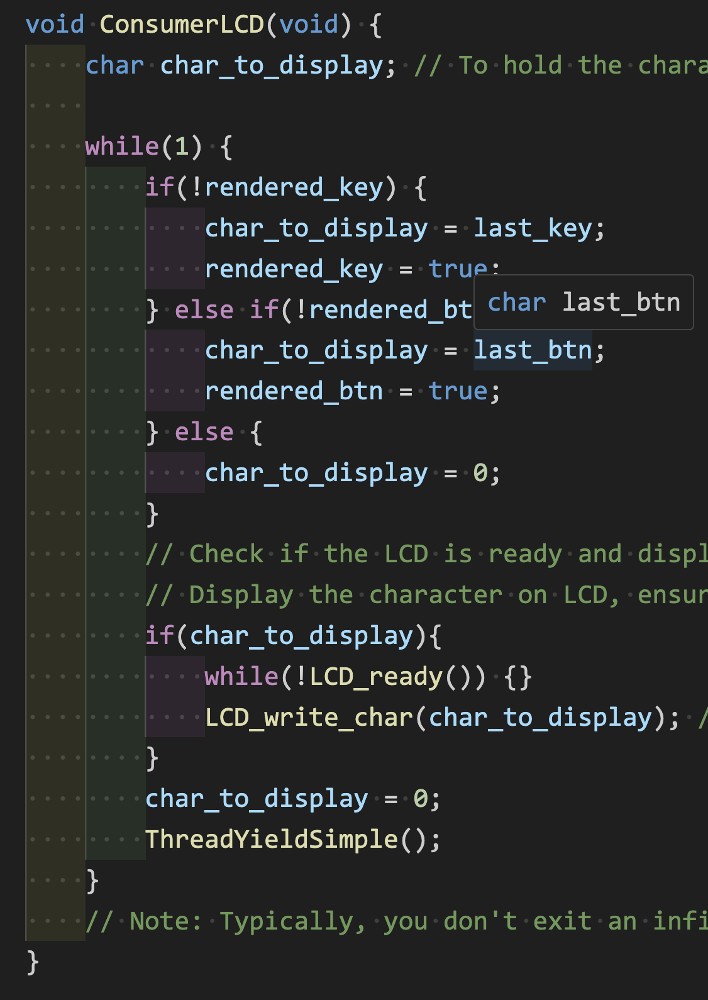
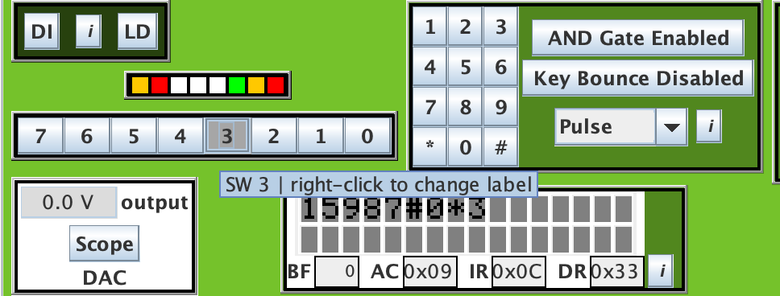

### Checkpoint5 (Final Project)

##### Global infos:

* Additional types are defined in `src/types.h`, like bool/uchar. Just for convinience.
* Some Additional utilities (for random number/debugging) are defined in `src/utils.h`.
* Beside the global var which is only used in `testlcd.c`, all the shared global var are in the `src/static_globals.h`
* Both dino game and testlcd share same Makefile but have different target, check README or typescript for more information.

#### Part1, Peripheral devices

##### Button bank

P2 is connected to the button (switch0~7).
If the value of P2 != 0xff, means we have some button pressed:

To check which btn is pressed, we just check each bit to check if it is pressed.

##### Keypad

All provided.

##### LCD

Change the `LCD_write_string` to be Macro which will be better. (passing const char array is quite tricky)

##### testlcd.c

2producer(keypad/button) + 1comsumer(lcd display) -> total 3 thread.

* Preemptive:

  * Since the loop of each thread are quite small and fast. Use roundrobin with ThreadYield.
    `ThreadYieldSimple`:

    So we will go thourgh each thread infinitely.
* Producer:

  * The workflow is: loop -> get input -> set flag if input -> loop
  * Both btn/keypad producer have exact same structure so use one of it as example:

    
* Comsumer:

  * Comsumer will try to receive `last_xxx` if rendered flag is false.
  * once received data, display it onto the LCD display.

    
* Demo:

  

#### Part2, dino game
